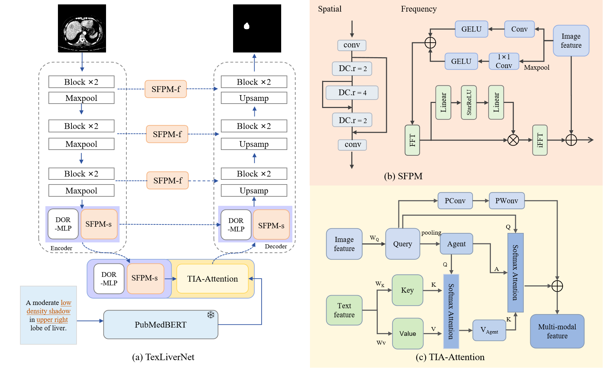

# TexLiverNet: Leveraging Medical Knowledge and Spatial-Frequency Perception for Enhanced Liver Tumor Segmentation

## Abstract

[//]: # (This repository contains the code for the paper **"PTQ4RIS: An Effective and Efficient Post-Training Quantization Framework for Referring Image Segmentation"**.)

Integrating textual data with imaging in liver tumor segmentation is essential for enhancing diagnostic accuracy.
However, current multi-modal medical datasets offer only general text annotations, lacking lesion-specific details critical for extracting nuanced features, especially for fine-grained segmentation of tumor boundaries and small lesions. 
To address these limitations, we developed datasets with lesion-specific text annotations for liver tumors and introduced the TexLiverNet model. 
TexLiverNet employs an agent-based cross-attention module that integrates text features efficiently with visual features, significantly reducing computational costs. 
Additionally, enhanced spatial and adaptive frequency domain perception is proposed to precisely delineate lesion boundaries, reduce background interference, and recover fine details in small lesions. 
Comprehensive evaluations on public and private datasets demonstrate that TexLiverNet achieves superior performance compared to current state-of-the-art methods. 

Paper: [arxiv](https://export.arxiv.org/abs/2411.04595) 

## Usage

### 1、Data Preparation
  [//]The original data can be downloaded in following links:
   [//] · 3D-IRCADb -[Link（Original）](https://www.ircad.fr/research/data-sets/liver-segmentation-3d-ircadb-01/)
    [//]· VTLiTS -It is being sorted out.
